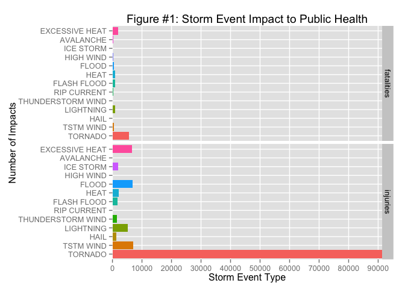

# Severe Weather Affect on US Public Health and the US Economy
Wayne Vest  
25 April 2015  

# Synopsis

Put text here

# Enironment Preparation

The following packages are used in this analysis:

- dplyr
- ggplot2


```r
# Check if dplyr is installed, and if not, install it
if(!("dplyr" %in% rownames(installed.packages()))){
    install.packages("dplyr")
}
# Load the dplyr library
require(dplyr)
```

```
## Loading required package: dplyr
## 
## Attaching package: 'dplyr'
## 
## The following object is masked from 'package:stats':
## 
##     filter
## 
## The following objects are masked from 'package:base':
## 
##     intersect, setdiff, setequal, union
```

```r
# Check if the ggplot2 package is installed, and if not, install it
if(!("ggplot2" %in% rownames(installed.packages()))){
    install.packages("ggplot2r")
}
# Load the ggplot2 library
require(ggplot2)
```

```
## Loading required package: ggplot2
```

# Data Processing

The data used in this analysis is available from `https://d396qusza40orc.cloudfront.net/repdata%2Fdata%2FStormData.csv.bz2` at the time of writing.

To import the data a temporary file is created, the bzipped file is downloaded to that temporary file location, then the temporary file is un-bzipped and loaded into memory as `raw_data`. This processes is cached to prevent proliferation of sizeable temporary files.


```r
# Create temporary file in a temporary folder
tmp_file = tempfile('StormData', fileext='.csv.bz2')
# Download the file
download.file('https://d396qusza40orc.cloudfront.net/repdata%2Fdata%2FStormData.csv.bz2', tmp_file, method='curl')
# Load the file, extracting from the bzip archive on the way
raw_data = read.csv(bzfile(tmp_file))
# Show the current state
str(raw_data)
```

```
## 'data.frame':	902297 obs. of  37 variables:
##  $ STATE__   : num  1 1 1 1 1 1 1 1 1 1 ...
##  $ BGN_DATE  : Factor w/ 16335 levels "1/1/1966 0:00:00",..: 6523 6523 4242 11116 2224 2224 2260 383 3980 3980 ...
##  $ BGN_TIME  : Factor w/ 3608 levels "00:00:00 AM",..: 272 287 2705 1683 2584 3186 242 1683 3186 3186 ...
##  $ TIME_ZONE : Factor w/ 22 levels "ADT","AKS","AST",..: 7 7 7 7 7 7 7 7 7 7 ...
##  $ COUNTY    : num  97 3 57 89 43 77 9 123 125 57 ...
##  $ COUNTYNAME: Factor w/ 29601 levels "","5NM E OF MACKINAC BRIDGE TO PRESQUE ISLE LT MI",..: 13513 1873 4598 10592 4372 10094 1973 23873 24418 4598 ...
##  $ STATE     : Factor w/ 72 levels "AK","AL","AM",..: 2 2 2 2 2 2 2 2 2 2 ...
##  $ EVTYPE    : Factor w/ 985 levels "   HIGH SURF ADVISORY",..: 834 834 834 834 834 834 834 834 834 834 ...
##  $ BGN_RANGE : num  0 0 0 0 0 0 0 0 0 0 ...
##  $ BGN_AZI   : Factor w/ 35 levels "","  N"," NW",..: 1 1 1 1 1 1 1 1 1 1 ...
##  $ BGN_LOCATI: Factor w/ 54429 levels ""," Christiansburg",..: 1 1 1 1 1 1 1 1 1 1 ...
##  $ END_DATE  : Factor w/ 6663 levels "","1/1/1993 0:00:00",..: 1 1 1 1 1 1 1 1 1 1 ...
##  $ END_TIME  : Factor w/ 3647 levels ""," 0900CST",..: 1 1 1 1 1 1 1 1 1 1 ...
##  $ COUNTY_END: num  0 0 0 0 0 0 0 0 0 0 ...
##  $ COUNTYENDN: logi  NA NA NA NA NA NA ...
##  $ END_RANGE : num  0 0 0 0 0 0 0 0 0 0 ...
##  $ END_AZI   : Factor w/ 24 levels "","E","ENE","ESE",..: 1 1 1 1 1 1 1 1 1 1 ...
##  $ END_LOCATI: Factor w/ 34506 levels ""," CANTON"," TULIA",..: 1 1 1 1 1 1 1 1 1 1 ...
##  $ LENGTH    : num  14 2 0.1 0 0 1.5 1.5 0 3.3 2.3 ...
##  $ WIDTH     : num  100 150 123 100 150 177 33 33 100 100 ...
##  $ F         : int  3 2 2 2 2 2 2 1 3 3 ...
##  $ MAG       : num  0 0 0 0 0 0 0 0 0 0 ...
##  $ FATALITIES: num  0 0 0 0 0 0 0 0 1 0 ...
##  $ INJURIES  : num  15 0 2 2 2 6 1 0 14 0 ...
##  $ PROPDMG   : num  25 2.5 25 2.5 2.5 2.5 2.5 2.5 25 25 ...
##  $ PROPDMGEXP: Factor w/ 19 levels "","-","?","+",..: 17 17 17 17 17 17 17 17 17 17 ...
##  $ CROPDMG   : num  0 0 0 0 0 0 0 0 0 0 ...
##  $ CROPDMGEXP: Factor w/ 9 levels "","?","0","2",..: 1 1 1 1 1 1 1 1 1 1 ...
##  $ WFO       : Factor w/ 542 levels ""," CI","%SD",..: 1 1 1 1 1 1 1 1 1 1 ...
##  $ STATEOFFIC: Factor w/ 250 levels "","ALABAMA, Central",..: 1 1 1 1 1 1 1 1 1 1 ...
##  $ ZONENAMES : Factor w/ 25112 levels "","                                                                                                                               "| __truncated__,..: 1 1 1 1 1 1 1 1 1 1 ...
##  $ LATITUDE  : num  3040 3042 3340 3458 3412 ...
##  $ LONGITUDE : num  8812 8755 8742 8626 8642 ...
##  $ LATITUDE_E: num  3051 0 0 0 0 ...
##  $ LONGITUDE_: num  8806 0 0 0 0 ...
##  $ REMARKS   : Factor w/ 436781 levels "","\t","\t\t",..: 1 1 1 1 1 1 1 1 1 1 ...
##  $ REFNUM    : num  1 2 3 4 5 6 7 8 9 10 ...
```

Further data processing is required, however there are different transformations required for each area of analysis. These additional processing/transformation activities are detailed in the respective sections of this document.

# Analysis

There are two key parts to the analysis:

- Storm event impact on public health
- Storm event impact on US economy

The data providers classify storm events into 48 categories as defined in the National Weather Service's Storm Data Preparation document available [here](https://d396qusza40orc.cloudfront.net/repdata%2Fpeer2_doc%2Fpd01016005curr.pdf) (https://d396qusza40orc.cloudfront.net/repdata%2Fpeer2_doc%2Fpd01016005curr.pdf). The raw_data contains several additional event types that are summaries of various kinds, such as per annum total values. For the purpose of this analysis, these 'summary' items have been ignored.

## Across the United States, which types of events (as indicated in the EVTYPE variable) are most harmful with respect to population health?

The data contains two generalised measures of health impact:

- `FATALITIES`
- `INJURIES`

It is likely that there is a significant difference in the impact on public health of the `FATALITIES` versus `INJURIES` variables values. In lieu of immediate access to appropriate authoritative research data on this issue, and for the purpose of this analysis, the weight of `FATALITIES` versus `INJURIES` will not be considered and each will be represented separately such that the reader can view the impact in both categories and weight them as desired.

### Step 1: Remove any observations that have NA values in any of the variables `EVTYPE`, `FATALITIES` or `INJURIES`

This analysis will generate a plot that shows:

- Event type versus fatalities
- Event type versus injuries


```r
# Select on the relevant data points to work with
pop_health_data = raw_data %>%
    # Take only the event type (EVTYPE), fatalities count (FATALITIES) and injury count (INJURIES)
    select(EVTYPE, FATALITIES, INJURIES) %>%
    # Remove all NA values and EVTYPE values that are summaries
    filter(!is.na(EVTYPE) & !grepl("^(?i)summary", EVTYPE) & !is.na(FATALITIES) & !is.na(INJURIES))
# Show the current state
str(pop_health_data)
```

```
## 'data.frame':	902222 obs. of  3 variables:
##  $ EVTYPE    : Factor w/ 985 levels "   HIGH SURF ADVISORY",..: 834 834 834 834 834 834 834 834 834 834 ...
##  $ FATALITIES: num  0 0 0 0 0 0 0 0 1 0 ...
##  $ INJURIES  : num  15 0 2 2 2 6 1 0 14 0 ...
```

### Step 2: Transform the data for plotting

A new data.frame will be created (`pop_health_plot_data`), with variables for:

- event type (`evtype`) - this captures the original Event Type designator from the raw_data
- impact type (`impact`) - either `fatalities` or `injuries` as appropriate
- count (`count`) - the sum of all values of the impact type for the event type

The new data.frame will only contain the top 10 event types for each impact type.


```r
# Create some temporary data.frames
pop_health_fatalities = data.frame()
pop_health_injuries = data.frame()
# Loop over all the event types, filtering for each event and summing the fatalities and injuries separately
for(type in unique(pop_health_data$EVTYPE)){
    data = filter(pop_health_data, EVTYPE==type)
    fatalities = sum(data$FATALITIES)
    injuries = sum(data$INJURIES)
    # Update the temporary data.frames to collate the data
    pop_health_fatalities = rbind(pop_health_fatalities, data.frame(evtype=type, impact='fatalities', count=fatalities))
    pop_health_injuries = rbind(pop_health_injuries, data.frame(evtype=type, impact='injuries', count=injuries))
}
# Generate a new data.frame to hold the final data ready for plotting, subsetting for only the top 10 results for each impact type
pop_health_plot_data = pop_health_fatalities[order(pop_health_fatalities$count, decreasing=TRUE)[1:10],]
pop_health_plot_data = rbind(pop_health_plot_data, pop_health_injuries[order(pop_health_injuries$count, decreasing=TRUE)[1:10],])
# Show the current state
str(pop_health_plot_data)
```

```
## 'data.frame':	20 obs. of  3 variables:
##  $ evtype: Factor w/ 919 levels "TORNADO","TSTM WIND",..: 1 99 20 27 15 2 36 18 46 73 ...
##  $ impact: Factor w/ 2 levels "fatalities","injuries": 1 1 1 1 1 1 1 1 1 1 ...
##  $ count : num  5633 1903 978 937 816 ...
```

### Step 3: Storm Event Impact on Public Health Representation

Figure #1 is a multi-facet plot that separately shows the top storm events that impact upon public health.


```r
# ggplot used over qplot due to the desire for the coord_flip function (not available in qplot), which tranposes the x and y axis. This is purely aesthetic, and is aimed at making the report more easily consumable.
ggplot(pop_health_plot_data, aes(x=evtype, y=count, fill=evtype)) + theme(legend.position="none") + geom_bar(stat='identity') + coord_flip() + facet_grid(impact ~ .) + ggtitle("Figure #1: Storm Event Impact to Public Health") + ylab("Storm Event Type") + xlab("Number of Impacts") + scale_y_discrete(breaks=c(seq(0,150000,10000)))
```

 

This plot clearly shows that `TORNADO` type events not only take the most life (5633 fatalities), but also cause the greatest injury (91346 injuries). This information will be discussed further in the Results section of this document.

## Across the United States, which types of events have the greatest economic consequences?

# Results

